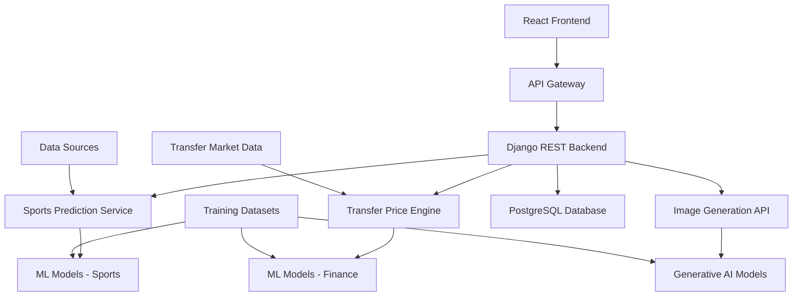

<div align="center">

</div>

<div align="center">

[](https://git.io/typing-svg)


</div>

---

<div align="center">


</div>

## PROJECT OVERVIEW

**SportsTech-AI** is an advanced AI-powered prediction platform that leverages machine learning algorithms to provide accurate forecasts across multiple domains. The platform specializes in sports analytics, financial predictions for player transfers, and creative AI capabilities through image generation, serving as a comprehensive solution for data-driven decision making.

### Core Applications

The platform addresses three key market segments:
- **Sports Analytics**: Match outcome predictions with statistical modeling
- **Transfer Market Intelligence**: Player valuation and transfer price forecasting
- **Creative AI Services**: Text-to-image generation for content creation

### Technical Architecture

SportsTech-AI implements a modern microservices architecture with clear separation between presentation, business logic, and data processing layers, ensuring scalability and maintainability for enterprise-grade applications.

---

<div align="center">


</div>

## TECHNICAL ARCHITECTURE

<div align="center">

### Frontend Technologies


### Backend Infrastructure


### AI & Machine Learning


</div>

### System Architecture

<div align="center">



</div>

---

## PLATFORM CAPABILITIES

### Sports Analytics Engine

**Match Prediction System:**
```python
class SportsPredictor:
    def __init__(self):
        self.models = {
            'football': load_model('football_predictor.pkl'),
            'basketball': load_model('basketball_predictor.pkl'),
            'tennis': load_model('tennis_predictor.pkl')
        }
        self.feature_extractors = FeatureExtractorFactory()
    
    def predict_match_outcome(self, team_a, team_b, sport='football'):
        features = self.extract_match_features(team_a, team_b)
        model = self.models[sport]
        
        prediction = model.predict_proba([features])[0]
        return {
            'team_a_win_probability': prediction[0],
            'draw_probability': prediction[1] if sport == 'football' else 0,
            'team_b_win_probability': prediction[-1],
            'confidence_score': max(prediction),
            'key_factors': self.get_prediction_factors(features)
        }
```

**Key Features:**
- Historical performance analysis
- Team strength assessment
- Player form evaluation
- Injury and suspension tracking
- Weather and venue impact analysis

### Transfer Price Prediction

**Player Valuation Model:**
```python
class TransferPricePredictor:
    def __init__(self):
        self.regression_model = load_model('transfer_price_model.pkl')
        self.feature_scaler = load_scaler('price_scaler.pkl')
        
    def predict_transfer_price(self, player_data):
        features = self.extract_player_features(player_data)
        scaled_features = self.feature_scaler.transform([features])
        
        predicted_price = self.regression_model.predict(scaled_features)[0]
        price_range = self.calculate_price_range(predicted_price)
        
        return {
            'predicted_price': predicted_price,
            'price_range': price_range,
            'market_factors': self.analyze_market_factors(player_data),
            'comparable_transfers': self.find_similar_transfers(player_data)
        }
```

**Valuation Factors:**
- Player performance metrics
- Age and career trajectory
- Contract duration
- Market demand indicators
- League and club prestige
- Position-specific value multipliers

### AI Image Generation

**Creative Content Engine:**
```python
class ImageGenerator:
    def __init__(self):
        self.model = load_diffusion_model('stable_diffusion_v2.1')
        self.prompt_optimizer = PromptOptimizer()
        
    def generate_image(self, text_prompt, style_options=None):
        optimized_prompt = self.prompt_optimizer.enhance(text_prompt)
        
        generation_params = {
            'prompt': optimized_prompt,
            'num_inference_steps': 50,
            'guidance_scale': 7.5,
            'width': 512,
            'height': 512
        }
        
        if style_options:
            generation_params.update(style_options)
            
        image = self.model.generate(**generation_params)
        
        return {
            'image_url': self.save_image(image),
            'prompt_used': optimized_prompt,
            'generation_time': self.get_generation_time(),
            'style_applied': style_options or 'default'
        }
```

---

<div align="center">


</div>

## PERFORMANCE METRICS

### Prediction Accuracy

<div align="center">

| **Model Type** | **Accuracy Rate** | **Data Points** | **Update Frequency** |
|:---------------|:------------------|:----------------|:---------------------|
| **Football Match Prediction** | ~78-82% | 10,000+ matches | Weekly |
| **Basketball Outcomes** | ~75-80% | 5,000+ games | Daily |
| **Transfer Price Estimation** | ~85% (±15% range) | 3,000+ transfers | Monthly |
| **Image Generation Quality** | 4.2/5.0 user rating | 1,000+ generations | Real-time |

</div>

### System Performance

**API Response Times:**
- Sports Predictions: <800ms average
- Transfer Price Analysis: <1.2s average  
- Image Generation: 8-15s depending on complexity
- Historical Data Queries: <300ms average

**Throughput Capabilities:**
- Concurrent predictions: 100+ requests/minute
- Image generation queue: 20 simultaneous jobs
- Database operations: 1,000+ queries/second
- Real-time data updates: Every 15 minutes

### Model Training Statistics

```python
# Training Performance Summary
MODEL_PERFORMANCE = {
    'sports_predictor': {
        'training_samples': 50000,
        'validation_accuracy': 0.798,
        'cross_validation_score': 0.784,
        'last_retrained': '2025-01-15'
    },
    'transfer_predictor': {
        'training_samples': 8500,
        'mae': 2.1,  # Million EUR
        'r_squared': 0.87,
        'last_retrained': '2025-01-10'
    }
}
```

---

## INSTALLATION & DEPLOYMENT

### Development Environment Setup

**Prerequisites:**
- Python 3.11+
- Node.js 18+
- PostgreSQL 14+
- Redis (for caching)
- Git

**Quick Start:**
```bash
# Clone the main repository
git clone https://github.com/abdeladime2003/SportsTech-AI.git
cd SportsTech-AI

# Initialize submodules
git submodule update --init --recursive

# Backend setup
cd Backend
python -m venv venv
source venv/bin/activate  # On Windows: venv\Scripts\activate
pip install -r requirements.txt

# Database setup
python manage.py migrate
python manage.py loaddata initial_data.json

# Frontend setup
cd ../Frontend
npm install
npm run build

# Start development servers
# Terminal 1 (Backend)
cd Backend && python manage.py runserver

# Terminal 2 (Frontend)  
cd Frontend && npm start
```

### Production Deployment

**Docker Configuration:**
```dockerfile
# Backend Dockerfile
FROM python:3.11-slim

WORKDIR /app
COPY requirements.txt .
RUN pip install --no-cache-dir -r requirements.txt

COPY . .
EXPOSE 8000

CMD ["gunicorn", "--bind", "0.0.0.0:8000", "SportsTech-AI.wsgi:application"]
```

**Docker Compose Setup:**
```yaml
version: '3.8'
services:
  backend:
    build: ./Backend
    ports:
      - "8000:8000"
    environment:
      - DATABASE_URL=postgresql://user:pass@db:5432/SportsTech-AI
      - REDIS_URL=redis://redis:6379/0
    depends_on:
      - db
      - redis

  frontend:
    build: ./Frontend
    ports:
      - "3000:3000"
    environment:
      - REACT_APP_API_URL=http://backend:8000

  db:
    image: postgres:14
    environment:
      - POSTGRES_DB=SportsTech-AI
      - POSTGRES_USER=user
      - POSTGRES_PASSWORD=password
    volumes:
      - postgres_data:/var/lib/postgresql/data

  redis:
    image: redis:7-alpine
    ports:
      - "6379:6379"

volumes:
  postgres_data:
```

---

## API DOCUMENTATION

### Core Endpoints

<div align="center">

| Method | Endpoint | Description | Response Time |
|:-------|:---------|:------------|:--------------|
| `POST` | `/api/predict/sports/` | Sports match prediction | <800ms |
| `POST` | `/api/predict/transfer/` | Player transfer price | <1200ms |
| `POST` | `/api/generate/image/` | AI image generation | 8-15s |
| `GET` | `/api/history/predictions/` | Prediction history | <200ms |
| `GET` | `/api/models/performance/` | Model accuracy stats | <100ms |

</div>

### API Usage Examples

**Sports Match Prediction:**
```javascript
// Predict football match outcome
const matchPrediction = await fetch('/api/predict/sports/', {
  method: 'POST',
  headers: {
    'Content-Type': 'application/json',
    'Authorization': `Bearer ${token}`
  },
  body: JSON.stringify({
    sport: 'football',
    team_a: {
      name: 'Manchester City',
      recent_form: [1, 1, 0, 1, 1],
      home_advantage: true
    },
    team_b: {
      name: 'Liverpool',
      recent_form: [1, 0, 1, 1, 0],
      home_advantage: false
    },
    match_date: '2025-02-15',
    venue: 'Etihad Stadium'
  })
});

const result = await matchPrediction.json();
console.log(`Win probability: ${result.team_a_win_probability * 100}%`);
```

**Transfer Price Prediction:**
```python
import requests

# Predict player transfer price
player_data = {
    "name": "Kylian Mbappé",
    "age": 26,
    "position": "Forward",
    "current_club": "PSG",
    "contract_expiry": "2025-06-30",
    "goals_last_season": 30,
    "assists_last_season": 8,
    "market_value_estimate": 180,  # Million EUR
    "nationality": "France"
}

response = requests.post(
    'http://localhost:8000/api/predict/transfer/',
    json=player_data,
    headers={'Authorization': f'Bearer {api_token}'}
)

prediction = response.json()
print(f"Predicted transfer price: €{prediction['predicted_price']:.1f}M")
```

**AI Image Generation:**
```python
# Generate sports-themed image
generation_request = {
    "prompt": "Professional football stadium at sunset, dramatic lighting",
    "style": "photorealistic",
    "dimensions": {"width": 1024, "height": 768},
    "quality": "high"
}

response = requests.post(
    'http://localhost:8000/api/generate/image/',
    json=generation_request
)

result = response.json()
image_url = result['image_url']
```

---

## PROJECT STRUCTURE

```
SportsTech-AI/
├── Backend/                          # Django REST API
│   ├── SportsTech-AI/
│   │   ├── settings/
│   │   │   ├── base.py              # Base configuration
│   │   │   ├── development.py       # Dev settings
│   │   │   └── production.py        # Production settings
│   │   ├── urls.py                  # Main URL configuration
│   │   └── wsgi.py                  # WSGI application
│   ├── apps/
│   │   ├── sports/
│   │   │   ├── models.py            # Sports data models
│   │   │   ├── views.py             # Sports prediction endpoints
│   │   │   ├── serializers.py       # Data serialization
│   │   │   └── ml_models.py         # ML model integration
│   │   ├── transfers/
│   │   │   ├── models.py            # Transfer market models
│   │   │   ├── views.py             # Transfer prediction API
│   │   │   └── price_engine.py      # Price prediction logic
│   │   ├── images/
│   │   │   ├── views.py             # Image generation endpoints
│   │   │   ├── generators.py        # AI image generation
│   │   │   └── storage.py           # Image storage handling
│   │   └── core/
│   │       ├── authentication.py    # Auth middleware
│   │       ├── permissions.py       # API permissions
│   │       └── utils.py             # Utility functions
│   ├── ml_models/                   # Trained model files
│   │   ├── sports_predictor.pkl
│   │   ├── transfer_model.pkl
│   │   └── scalers/
│   ├── requirements.txt             # Python dependencies
│   └── manage.py                    # Django management
├── Frontend/                        # React application
│   ├── src/
│   │   ├── components/
│   │   │   ├── common/              # Reusable components
│   │   │   ├── sports/              # Sports prediction UI
│   │   │   ├── transfers/           # Transfer analysis UI
│   │   │   └── images/              # Image generation UI
│   │   ├── pages/
│   │   │   ├── Dashboard.jsx        # Main dashboard
│   │   │   ├── Sports.jsx           # Sports predictions
│   │   │   ├── Transfers.jsx        # Transfer market
│   │   │   └── ImageGen.jsx         # Image generation
│   │   ├── services/
│   │   │   ├── api.js               # API client
│   │   │   ├── auth.js              # Authentication
│   │   │   └── predictions.js       # Prediction services
│   │   ├── hooks/                   # Custom React hooks
│   │   ├── utils/                   # Utility functions
│   │   └── styles/                  # Tailwind configurations
│   ├── public/                      # Static assets
│   ├── package.json                 # Node dependencies
│   └── tailwind.config.js           # Tailwind setup
├── docs/                            # Documentation
│   ├── api/                         # API documentation
│   ├── deployment/                  # Deployment guides
│   └── models/                      # ML model documentation
├── docker-compose.yml               # Container orchestration
├── .gitmodules                      # Git submodule configuration
└── README.md                        # Project documentation
```

---

## DEVELOPMENT ROADMAP

### Current Development Status

**Completed Features:**
- ✅ Core platform architecture
- ✅ Sports prediction models (Football, Basketball)
- ✅ Transfer price estimation engine
- ✅ AI image generation integration
- ✅ RESTful API endpoints
- ✅ React-based user interface

**In Progress:**
- 🔄 Real-time data integration
- 🔄 Advanced analytics dashboard
- 🔄 Mobile-responsive improvements
- 🔄 Performance optimization

### Future Enhancements

**Phase 1 (Q1 2026):**
- Enhanced prediction accuracy through ensemble methods
- Real-time live match prediction updates
- Advanced data visualization components
- User account system with prediction history

**Phase 2 (Q2 2026):**
- Mobile application development (React Native)
- Integration with major sports data providers
- Advanced transfer market analytics
- AI-powered content generation beyond images

**Phase 3 (Q3 2026):**
- Predictive analytics for injury risk
- Fantasy sports integration
- Betting odds comparison
- Social features and community predictions

### Technical Improvements

**Performance Optimization:**
- Model caching and optimization
- Database query optimization
- CDN integration for image delivery
- API rate limiting and monitoring

**Scalability Enhancements:**
- Microservices architecture migration
- Container orchestration with Kubernetes
- Load balancing and auto-scaling
- Distributed model serving

---

## CONTRIBUTING

### Development Guidelines

**Code Quality Standards:**
- Follow PEP 8 for Python code
- Use ESLint and Prettier for JavaScript
- Implement comprehensive unit tests
- Document all API endpoints
- Code coverage minimum: 80%

**Machine Learning Standards:**
- Version all trained models
- Document model training procedures
- Implement model validation pipelines
- Monitor model performance in production

### Contribution Workflow

```bash
# 1. Fork the repository
git clone https://github.com/yourusername/SportsTech-AI.git

# 2. Create feature branch
git checkout -b feature/new-prediction-model

# 3. Make changes and test
python -m pytest tests/
npm test

# 4. Commit with conventional commit format
git commit -m "feat: add tennis match prediction model"

# 5. Push and create pull request
git push origin feature/new-prediction-model
```

---

## LICENSE & CONTACT

**License**: MIT License - see [LICENSE](LICENSE) file for details.

**Project Lead**: Abdeladime Benali  
**Email**: abdeladimebenali2003@gmail.com  
**LinkedIn**: [linkedin.com/in/abdeladime-benali](https://linkedin.com/in/abdeladime-benali)  
**GitHub**: [github.com/abdeladime2003](https://github.com/abdeladime2003)

---

<div align="center">


**AI-Powered Prediction Platform | INPT 2025**

</div>
